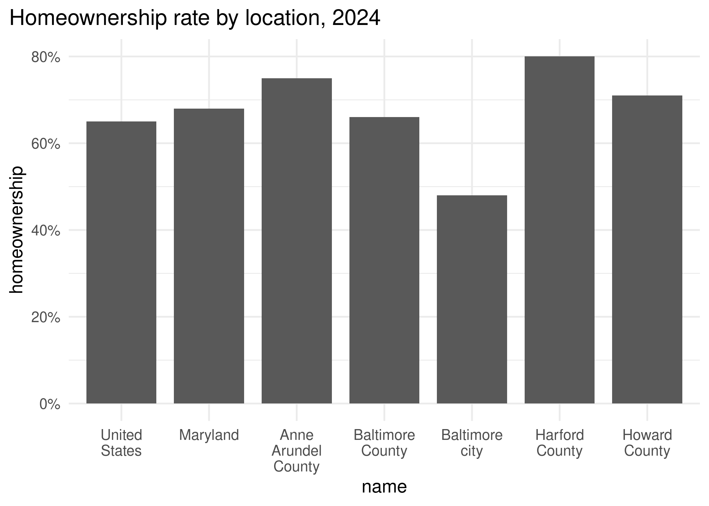
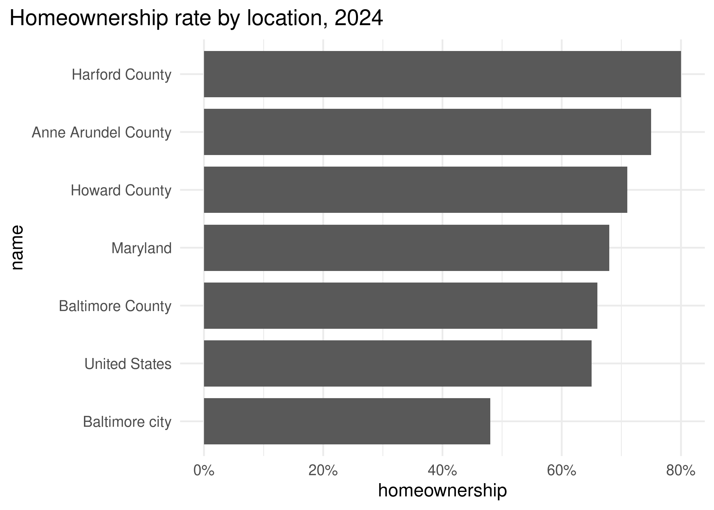
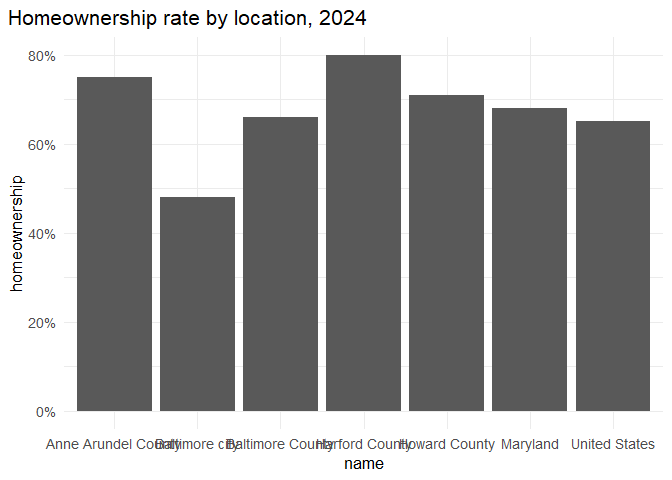
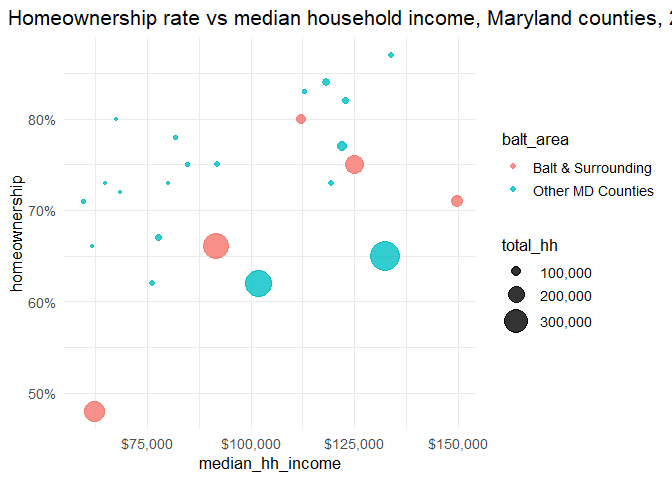
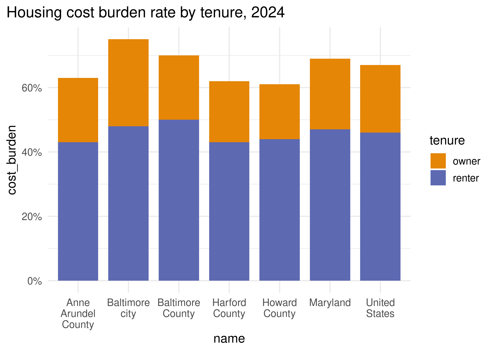
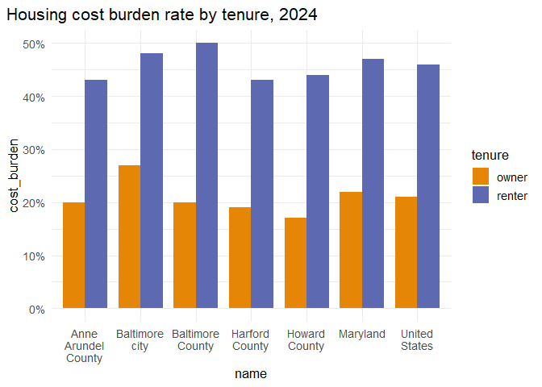

# Visual encodings


In this lab, we’ll practice properly mapping data onto visual encodings.
First, you’ll take notes on the encodings used in several charts. Then
you’ll edit code to improve or correct some encodings.

Some references to use with this lab:

- Wilke’s book, chapters
  [2](https://clauswilke.com/dataviz/aesthetic-mapping.html) and
  [17](https://clauswilke.com/dataviz/proportional-ink.html)
- Munzner’s chart of visual encoding rankings [on the course notes
  site](https://umbc-viz.github.io/ges778/extras/encodings.html)
- The [ggplot2 documentation](https://ggplot2.tidyverse.org)

## Identifying encodings

For each chart, jot down the following:

- Type of chart
- All major encodings (x- and y-axes, size, color, shape, etc.)
- What encoding your brain *primarily* reads to understand the data
  (lightness, position, length, etc.)
- What pattern is highlighted by this type of chart (distribution,
  absolute amounts, relative amounts, etc.)
- Any markings that guide you in reading the chart
- Anything that is not essential to understanding the chart (i.e. “chart
  junk”)

### Chart 1



- Bar Chart
- X-axis is county, y-axis is homeownership
- Length is the primary encoding
- These are percentages which are a relative amount
- x-axis labelling county name, y-axis labelling homeownership
  percentage, title showing the year
- Vertical gridlines are not needed

### Chart 2

 - Bar chart - same as above but x
and y axis are swapped - length - relative amounts (percentages) - same
as above - now the horizontal gridlines are unnecessary

### Chart 3


- Googling tells me this is a strip plot
- y axis is location name, x axis is home ownership
- Position is now the primary encoding
- Relative amounts of percentages
- same as above, but this time the horizontal and vertical gridlines
  both feel helpful
- nothing, imo

### Chart 4


- Boxplot
- x-axis is homeownership, y-axis is county name
- length (as in the width of the middle quartiles)
- relative amounts again, but distribution too i think
- same as before
- nothing is unnecessary to me here, i think id like more gridlines for
  percentages….

### Chart 5


- Line chart
- Date on x-axis, unemployment on y-axis, name of region is color
- not sure if this counts, but the gap between the 2 lines is what
  stands out to me
- relative amounts, namely the difference between the values
- gridlines
- everything essential

### Chart 6


- area under curve chart maybe?
- same as above minus an encoding for color
- the area under the curve
- relative amounts
- gridlines again
- i think the area under curve isn’t necessary here, but it does help
  balance out the chart’s values

### Chart 7


- I think this is called a bubble plot or a bubble scatter plot.
- Color is the region name, y axis is homeownership percent, x axis is
  median household income, size is total number of households I think
- Position is the primary encoding to me
- Distribution stands out to me, showing where a range of locations lie
  along the matrix
- the legend for household number is helpful
- everything seems useful here

## Correcting encodings

For each of these charts, write down what is wrong with the encodings.
Then edit the code to correct it.

``` r
library(dplyr)
```

    Warning: package 'dplyr' was built under R version 4.5.3


    Attaching package: 'dplyr'

    The following objects are masked from 'package:stats':

        filter, lag

    The following objects are masked from 'package:base':

        intersect, setdiff, setequal, union

``` r
library(ggplot2)
```

    Warning: package 'ggplot2' was built under R version 4.5.3

``` r
# set a default theme
theme_set(
    theme_minimal(base_size = 13) + theme(plot.title.position = "plot")
)

# pull a carto color palette
qual_pal <- rcartocolor::carto_pal(name = "Vivid")

# for convenience, filter just main locations
acs_balt <- justviz::acs |>
    filter(
        name %in%
            c(
                "United States",
                "Maryland",
                "Baltimore city",
                "Baltimore County",
                "Anne Arundel County",
                "Harford County",
                "Howard County"
            )
    )
```

### Chart 8


- this being a line chart implies that there is some sort of change
  between the counties
- should be a bar chart or i guess just points

``` r
# Hint: ggplot has some guardrails to keep you from making bad charts
# I needed to add a dummy variable to get around that
acs_balt |>
    mutate(datasource = "acs") |>
    ggplot(aes(x = name, y = homeownership, group = datasource)) +
    geom_col() +
    scale_y_continuous(labels = scales::label_percent()) +
    labs(title = "Homeownership rate by location, 2024")
```



### Chart 9


- obviously missing the comparison between baltimore areas vs other
  maryland counties
- i dont know if this is an error because i actually think it doesnt
  impact how the chart is read, but the scale for number of household’s
  lowest end is larger than the smallest values we see so it’s hard to
  know how small those regions are

``` r
# Hint: compare to chart 7
helper_var <- justviz::acs |>
    filter(level == "county")
justviz::acs |>
    filter(level == "county") |>
    mutate(balt_area = case_when(
      name %in% c("Baltimore city", "Baltimore County", "Howard County", "Harford County", "Anne Arundel County") ~ "Balt & Surrounding",
      TRUE                                              ~ "Other MD Counties"
    )) |> 
    ggplot(aes(x = median_hh_income, y = homeownership, size = total_hh, color = balt_area)) +
    geom_point(alpha = 0.8) +
    scale_radius(labels = scales::label_comma(), range = c(1, 10)) +
    scale_x_continuous(labels = scales::label_currency()) +
    scale_y_continuous(labels = scales::label_percent()) +
    labs(
        title = "Homeownership rate vs median household income, Maryland counties, 2024"
    )
```



### Chart 10



- these cannot be stacked

``` r
# reshape data to use color
  
    # not sure what this part means? ^^^

# someone please remind Camille to go over this
cost_burden <- acs_balt |>
    select(name, owner_cost_burden, renter_cost_burden) |>
    tidyr::pivot_longer(
        -name,
        names_to = c("tenure", ".value"),
        names_pattern = "(^[a-z]+)_(\\w+$)",
        names_ptypes = list(tenure = factor())
    )

ggplot(cost_burden, aes(x = name, y = cost_burden, fill = tenure)) +
    geom_col(width = 0.8, position = "dodge") +
    scale_fill_manual(values = qual_pal[c(1, 2)]) +
    scale_x_discrete(labels = scales::label_wrap(10)) +
    scale_y_continuous(labels = scales::label_percent()) +
    labs(title = "Housing cost burden rate by tenure, 2024")
```


