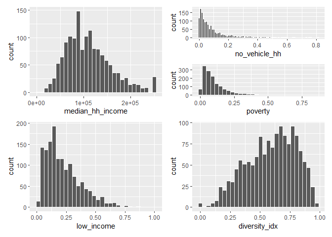
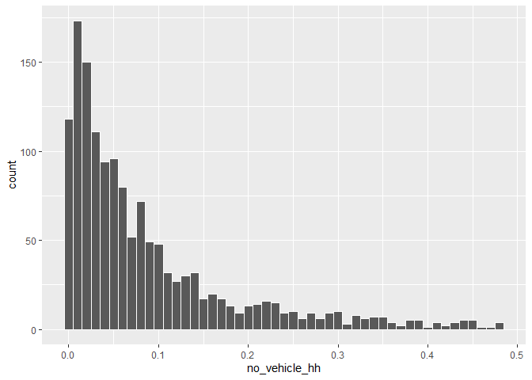
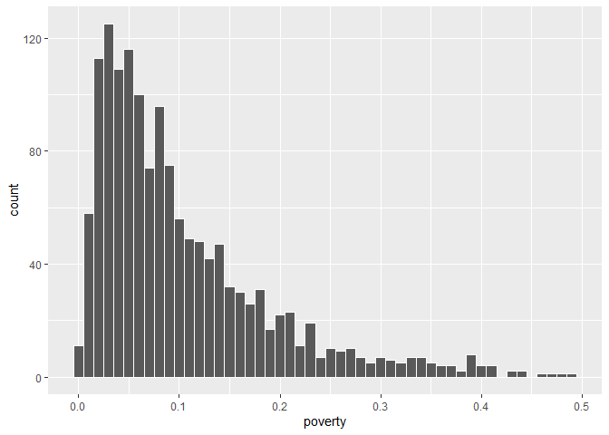
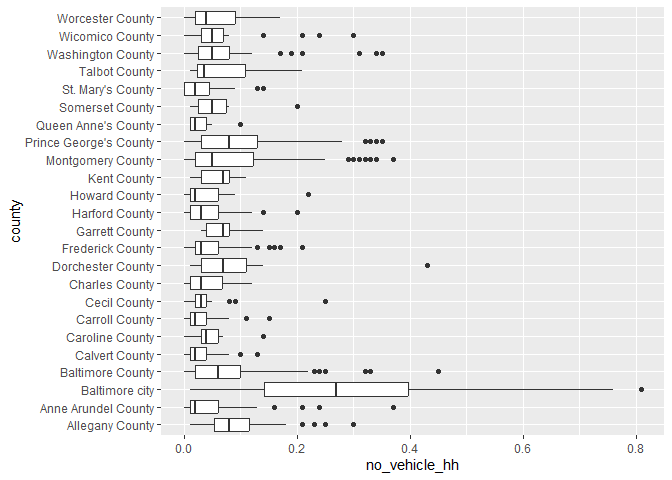
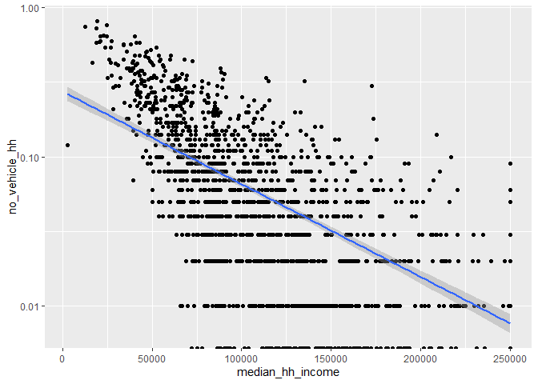
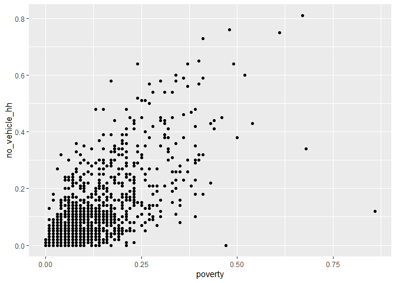
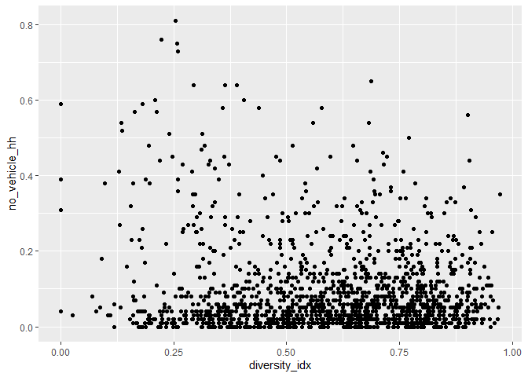
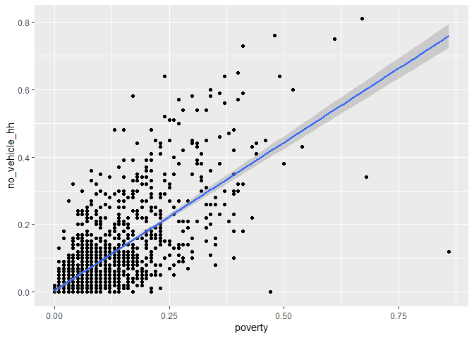

# Exploratory data visualization


For this lab, you’ll do some EDV with the ACS data, taking similar steps
to what I did in the EDV course notes. Start with a subset of just data
for tracts, and some variables you’ll explore. Choose at least 6 numeric
variables, plus keep county and name. (Don’t use ages 25+, poverty
status determined, or total housing units; those are all just there as
denominators.)

``` r
library(ggplot2)
test_acs <- justviz::acs

acs_tracts <- justviz::acs |>
    dplyr::filter(level == "tract") |>
    dplyr::select(county, name, median_hh_income, no_vehicle_hh, poverty, low_income, diversity_idx)
```

Look at the first few rows of data, and print a summary. Jot down
anything that seems noteworthy—missing values, very high or low values,
etc.

Nothing noteworthy, correct number of unique counties, very few NAs for
each.

``` r
summary(acs_tracts)
```

           county            name      median_hh_income no_vehicle_hh    
     Length   :1460   Length   :1460   Min.   :  2499   Min.   :0.00000  
     N.unique :  24   N.unique :1460   1st Qu.: 74966   1st Qu.:0.02000  
     N.blank  :   0   N.blank  :   0   Median :103192   Median :0.05000  
     Min.nchar:  11   Min.nchar:  11   Mean   :110249   Mean   :0.09591  
     Max.nchar:  22   Max.nchar:  11   3rd Qu.:137163   3rd Qu.:0.12000  
                                       Max.   :250001   Max.   :0.81000  
                                       NAs    :8        NAs    :4        
        poverty         low_income     diversity_idx   
     Min.   :0.0000   Min.   :0.0100   Min.   :0.0000  
     1st Qu.:0.0400   1st Qu.:0.1100   1st Qu.:0.4388  
     Median :0.0800   Median :0.1900   Median :0.6167  
     Mean   :0.1049   Mean   :0.2276   Mean   :0.5907  
     3rd Qu.:0.1400   3rd Qu.:0.3100   3rd Qu.:0.7586  
     Max.   :0.8600   Max.   :1.0000   Max.   :0.9728  
     NAs    :4        NAs    :4                        

## Variation

For each numeric variable in your data, make a histogram. Adjust the
number of bins or the binwidths for each one until you find something
easy to read and that shows the data well. Again, jot down what you
notice about the distributions.

They all follow distributions with nothing that visually stand out to
me, except for median_hh_income, but that was explained in class: the
highest bin is so large because ACS just assigns any tracts with a
median hh income \> \$250,000 as \$250,001. No vehicle HH and poverty
rate both have extreme skews.

``` r
library(patchwork)
median_hh_income <- ggplot(acs_tracts, aes(x = median_hh_income)) +
    geom_histogram(color = "white")
no_vehicle_hh <- ggplot(acs_tracts, aes(x = no_vehicle_hh)) +
    geom_histogram(color = "white", binwidth = 0.01)
poverty <- ggplot(acs_tracts, aes(x = poverty)) +
    geom_histogram(color = "white")
low_income <- ggplot(acs_tracts, aes(x = low_income)) +
    geom_histogram(color = "white")
diversity_idx <- ggplot(acs_tracts, aes(x = diversity_idx)) +
    geom_histogram(color = "white")
median_hh_income + no_vehicle_hh /
  poverty + low_income + diversity_idx
```

    `stat_bin()` using `bins = 30`. Pick better value `binwidth`.

    Warning: Removed 8 rows containing non-finite outside the scale range
    (`stat_bin()`).

    Warning: Removed 4 rows containing non-finite outside the scale range
    (`stat_bin()`).

    `stat_bin()` using `bins = 30`. Pick better value `binwidth`.

    Warning: Removed 4 rows containing non-finite outside the scale range
    (`stat_bin()`).

    `stat_bin()` using `bins = 30`. Pick better value `binwidth`.

    Warning: Removed 4 rows containing non-finite outside the scale range
    (`stat_bin()`).

    `stat_bin()` using `bins = 30`. Pick better value `binwidth`.



## Unusual values

For one of your variables with a heavy skew or some extreme values,
filter the data either with `dplyr::filter` or by setting axis limits
like I did in the notes. What can you see by removing these extreme
values?

``` r
acs_tracts |>
    dplyr::filter(no_vehicle_hh < 0.5) |>
    ggplot(aes(x = no_vehicle_hh)) +
    geom_histogram(color = "white", binwidth = .01)
```



``` r
acs_tracts |>
    dplyr::filter(poverty < 0.5) |>
    ggplot(aes(x = poverty)) +
    geom_histogram(color = "white", binwidth = .01)
```



## Covariation

Next, choose one of your numeric variables and make a series of boxplots
of it by county. To do this, you can put the variable you’re studying on
the x-axis and county on the y-axis, then use `geom_boxplot`. What
patterns can you see now that were obscured by looking at all tracts in
the state lumped together?

``` r
ggplot(acs_tracts, aes(x = no_vehicle_hh, y = county)) +
  geom_boxplot()
```

    Warning: Removed 4 rows containing non-finite outside the scale range
    (`stat_boxplot()`).



Pick a variable you want to investigate; pretend you’re going to build a
model to predict this variable (dependent variable). Choose another
variable that you think could be a feature in your model (independent
variable), and make a scatterplot with your dependent variable on the
y-axis and your independent variable on the x-axis. If it’s too dense to
read easily, try different strategies to reduce overplotting. Repeat
this with 2 more independent variables.

``` r
ggplot(acs_tracts, aes(y = no_vehicle_hh, x = median_hh_income)) +
  geom_point() +
  scale_y_log10() +
  geom_smooth(method = lm)
```

    Warning in scale_y_log10(): log-10 transformation introduced infinite values.
    log-10 transformation introduced infinite values.

    `geom_smooth()` using formula = 'y ~ x'

    Warning: Removed 125 rows containing non-finite outside the scale range
    (`stat_smooth()`).

    Warning: Removed 8 rows containing missing values or values outside the scale range
    (`geom_point()`).



``` r
ggplot(acs_tracts, aes(y = no_vehicle_hh, x = poverty)) +
  geom_point()
```

    Warning: Removed 4 rows containing missing values or values outside the scale range
    (`geom_point()`).



``` r
ggplot(acs_tracts, aes(y = no_vehicle_hh, x = diversity_idx)) +
  geom_point()
```

    Warning: Removed 4 rows containing missing values or values outside the scale range
    (`geom_point()`).



Now pick one of those independent variables that you think could
potentially be used in a linear regression model. On your scatterplot,
add a regression line with `geom_smooth(method = lm)` (see [the
docs](https://ggplot2.tidyverse.org/reference/geom_smooth.html))

``` r
ggplot(acs_tracts, aes(y = no_vehicle_hh, x = poverty)) +
  geom_point() +
  geom_smooth(method = lm)
```

    `geom_smooth()` using formula = 'y ~ x'

    Warning: Removed 4 rows containing non-finite outside the scale range
    (`stat_smooth()`).

    Warning: Removed 4 rows containing missing values or values outside the scale range
    (`geom_point()`).



What does the regression line tell you?

It tells me that the data do indeed follow a linear regression but there
is a lot of variation in the low values
