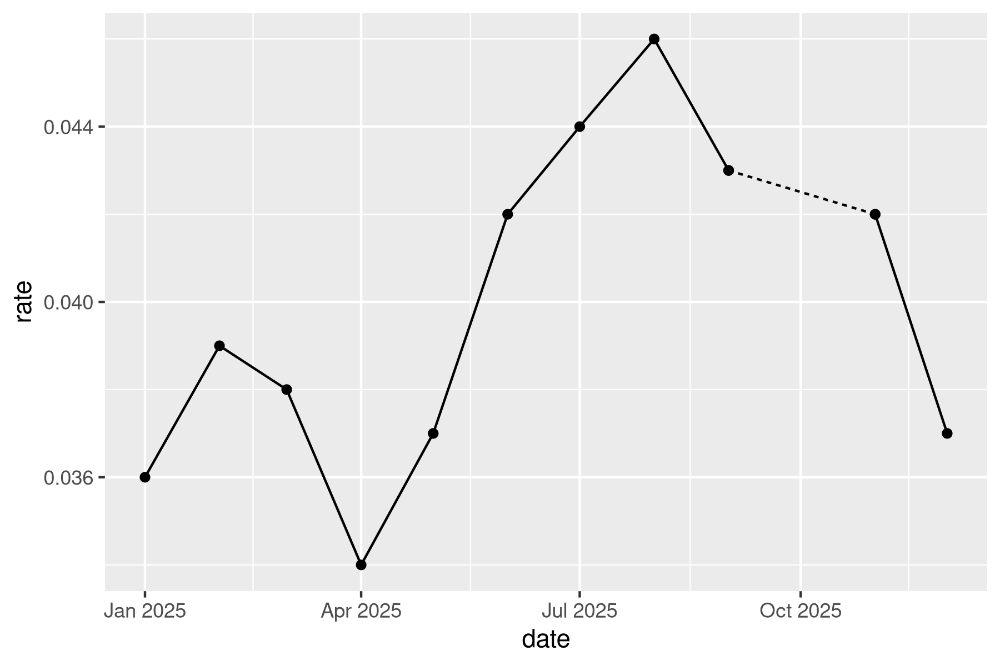

## Slicing & dicing trends

Imagine you're a slimy political operative consulting on a campaign for some office in the Maryland county of your choice. You have access to unemployment data since the start of 2020, when the opposing candidate took office. You want to make them look bad, so you cherrypick the data to make it look like unemployment has only increased lately so you can blame it on them. 

Filter the data for just the county you choose. Then further filter, summarize, or otherwise manipulate the data to make a chart that tells the misleading story you want.

```{r}
#| label: setup
library(ggplot2)
library(ggpubr)
library(tidyverse)
unemp_since_2020 <- justviz::unemployment |>
    dplyr::filter(lubridate::year(date) >= 2020)

county_unemp <- unemp_since_2020 |>
    dplyr::filter(name == "Anne Arundel County") |> 
    dplyr::filter(lubridate::year(date) >= 2023, lubridate::date(date) <= "2025-08-01")
```


```{r}
#| label: misleading-unemployment
file.info("06_details/angry.png")
ggplot(county_unemp, aes(x = date, y = rate, color = rate)) +
  background_image(png::readPNG("angry.png")) +
  geom_line(size = 3) +
  scale_color_gradient(low = "green", high = "red") +
  theme(axis.text = element_blank(), axis.ticks = element_blank(), panel.background = element_blank(), panel.grid.major = element_blank()) +
  labs(title = "Unemployment under INCUMBENT", x = "Time", y = "People Out of Jobs")
```

## Missing data

Now you're back to being a responsible data visualization professional. Filter the data again, this time for just 2025 and 1 location of your choice (doesn't have to be the same as above). We're going to fill in that gap from the government shutdown (October 2025). Use a solid line for the recorded rates, and a dashed or dotted line where you fill in between them.

Think of this task like a puzzle, and maybe sketch it on paper first. You'll probably need to add at least one new variable to your data. Some hints:

* You want to draw a line that includes October, but only that 1 observation is missing. You can't draw a line with only 1 point; you need at least 2.
* You can identify missing data with `is.na(rate)`, which returns `TRUE` if a value is NA, or `FALSE` if not.
* Read the docs for `dplyr::lead` and `dplyr::lag`. If you use them, set `default = FALSE` (ask me about this if it doesn't make sense, it's just a curveball that gets me every time).
* You can add multiple `geom_line` calls, or you can do your calculations and bind your data back together, then map a variable across an encoding like linetype. The first of these is simpler, but the second is more flexible.

General idea you're going for is like this:



```{r}
#| label: unemployment-gap
county_unemp_2025 <- unemp_since_2020 |>
    filter(name == "Anne Arundel County") |> 
    filter(lubridate::year(date) == 2025) |> 
    mutate(rate_estimate = case_when(
      !is.na(rate) ~ rate,
      is.na(rate) ~ (abs(lead(rate)+lag(rate)))/2
    )) #|> 
  # rename(rate_real = rate) |> 
  # pivot_longer(cols = c(rate_real, rate_estimate),
  #              names_to = "validity",
  #              values_to = "rate")

# okay i tried REALLY hard to make it work without using multiple geom lines but I couldn't
# I commented out the pivot longer because it didn't serve a purpose if I just did multiple geom_lines

ggplot(county_unemp_2025, aes(x = date, y = rate)) +
  geom_line(aes(y = rate_estimate), linetype = "dotted", linewidth = 1) +
  geom_line(aes(y = rate), linetype = "solid", linewidth = 1.1) +
  geom_point(size = 2)
```

## Distributions vs summaries

Pick 2 variables from the ACS data. Filter for just tracts within 5-7 counties (i.e. filter for `level == "tract"` and `county %in% c(list of counties)`). For each variable, experiment with different ways of showing distributions both within each group and across them. `geom_boxplot`, `geom_density`, or even `geom_point` are good places to start. Try calculating summary statistics in order to use `geom_linerange`, a combination of points and paths, or similar functions to show a range. Some interesting examples are in [Wilke's chapter on many distributions](https://clauswilke.com/dataviz/boxplots-violins.html).

```{r}
#| label: distributions
library(patchwork)
acs_tracts <- justviz::acs |>
    dplyr::filter(level == "tract") |>
    dplyr::select(county, name, no_vehicle_hh, poverty) |> 
    dplyr::filter(county %in% c("Anne Arundel County", "Prince George's County", "Howard County", "Baltimore County", "Calvert County", "Montgomery County"))

car_dense <- ggplot(acs_tracts, aes(x = no_vehicle_hh, fill = county)) +
  geom_density(alpha = 0.2)
car_box <- ggplot(acs_tracts, aes(x = no_vehicle_hh, y = county)) +
  geom_boxplot()
pov_dense <- ggplot(acs_tracts, aes(x = poverty, fill = county)) +
  geom_density(alpha = 0.2)
pov_box <- ggplot(acs_tracts, aes(x = poverty, y = county)) +
  geom_boxplot()
car_dense
pov_dense
car_box
pov_box
```

