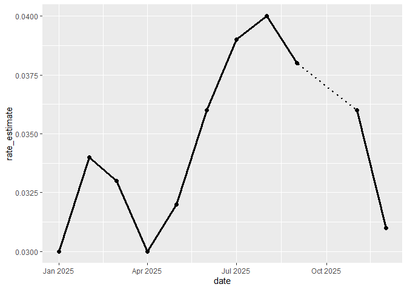
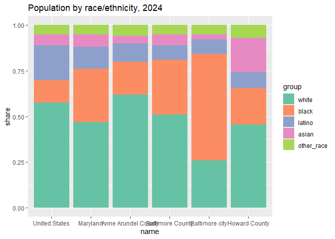
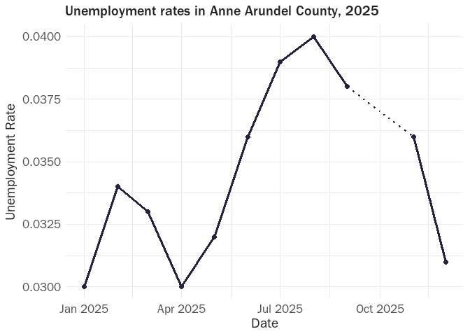
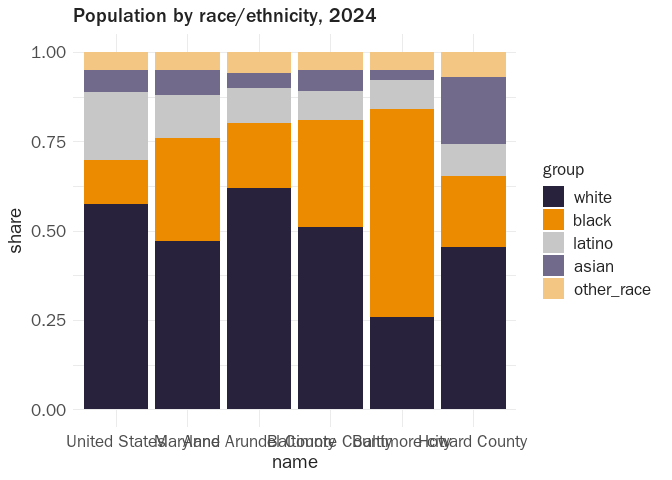

# Themes and using a styleguide


Pick 2 charts of different types from previous labs. Copy & paste the
code here. Looking at the styleguide you chose last week, build color
palettes and a theme that will replicate aspects of that styleguide. You
don’t have to adhere to everything; feel free to tweak the colors or
other specifications.
https://raw.githubusercontent.com/glosophy/CatoDataVizGuidelines/refs/heads/master/PocketStyleBook.pdf

``` r
library(tidyverse)
```

    ── Attaching core tidyverse packages ──────────────────────── tidyverse 2.0.0 ──
    ✔ dplyr     1.2.1     ✔ readr     2.2.0
    ✔ forcats   1.0.1     ✔ stringr   1.6.0
    ✔ ggplot2   4.0.3     ✔ tibble    3.3.1
    ✔ lubridate 1.9.5     ✔ tidyr     1.3.2
    ✔ purrr     1.2.2     
    ── Conflicts ────────────────────────────────────────── tidyverse_conflicts() ──
    ✖ dplyr::filter() masks stats::filter()
    ✖ dplyr::lag()    masks stats::lag()
    ℹ Use the conflicted package (<http://conflicted.r-lib.org/>) to force all conflicts to become errors

``` r
county_unemp_2025 <- justviz::unemployment |>
    filter(lubridate::year(date) >= 2020) |>
    filter(name == "Anne Arundel County") |> 
    filter(lubridate::year(date) == 2025) |> 
    mutate(rate_estimate = case_when(
      !is.na(rate) ~ rate,
      is.na(rate) ~ (abs(lead(rate)+lag(rate)))/2
    ))

ggplot(county_unemp_2025, aes(x = date, y = rate)) +
  geom_line(aes(y = rate_estimate), linetype = "dotted", linewidth = 1) +
  geom_line(aes(y = rate), linetype = "solid", linewidth = 1.1) +
  geom_point(size = 2)
```

    Warning: Removed 1 row containing missing values or values outside the scale range
    (`geom_point()`).



``` r
locations <- c(
    "United States",
    "Maryland",
    "Baltimore city",
    "Baltimore County",
    "Anne Arundel County",
    "Howard County"
)

race <- justviz::acs |>
    dplyr::filter(name %in% locations) |>
    dplyr::select(level, name, white, black, latino, asian, other_race) |>
    tidyr::pivot_longer(
        -level:-name,
        names_to = "group",
        values_to = "share"
    ) |>
    dplyr::mutate(dplyr::across(c(name, group), forcats::as_factor))

ggplot(race, aes(x = name, y = share, fill = group)) +
    geom_col(position = position_fill(reverse = TRUE)) +
    labs(title = "Population by race/ethnicity, 2024") +
    scale_fill_brewer(palette = "Set2")
```



``` r
library(showtext)
```

    Loading required package: sysfonts

    Loading required package: showtextdb

``` r
font_add(family = "cato_title", regular = "ITC Franklin Gothic Std Medium.otf")
font_add(family = "cato_standard", regular = "ITC Franklin Gothic Std Book.otf")

showtext_auto()

theme_set(
  theme_minimal(
    base_family = "cato_standard",
    base_size = 13
  ) +
    theme(
      text = element_text(color = "#222222"),
      plot.title = element_text(
        family = "cato_title",
        size = 15),
      plot.subtitle = element_text(
        size = 15),
      axis.title = element_text(
        size = 14),
      axis.text = element_text(
        size = 13),
      legend.text = element_text(
        size = 13),
      legend.title = element_text(
        size = 13),
      plot.caption = element_text(
        size = 12)
    )
)

ggplot(mtcars, aes(wt, mpg)) +
  geom_point() +
  labs(title = "Fuel Efficiency by Vehicle Weight")
```


``` r
ggplot(county_unemp_2025, aes(x = date, y = rate)) +
  geom_line(aes(y = rate_estimate), linetype = "dotted", linewidth = 1, color = "#28223C") +
  geom_line(aes(y = rate), linetype = "solid", linewidth = 1.1, color = "#28223C") +
  geom_point(size = 2, color = "#28223C") +
  labs(
    title = "Unemployment rates in Anne Arundel County, 2025",
    x = "Date",
    y= "Unemployment Rate"
  )
```

    Warning: Removed 1 row containing missing values or values outside the scale range
    (`geom_point()`).



The Cato institute suggests not having 5 or more groups, and
consoloditating down to 4 or 3, but that isn’t realistic for ethnicity
data so I am basing my color scheme off the 4 categories implementation
and adding a light orange: “For four color groups, use dark purple,
orange, grey, and light purple. Legends should be placed at the bottom
of the chart.”

``` r
ggplot(race, aes(x = name, y = share, fill = group)) +
    geom_col(position = position_fill(reverse = TRUE)) +
    labs(title = "Population by race/ethnicity, 2024") +
    scale_fill_manual(
    values = c(
    "#28223C",
    "#ED8B00",
    "#C7C7C7",
    "#716A8A",
    "#F4C684"
  )
)
```


